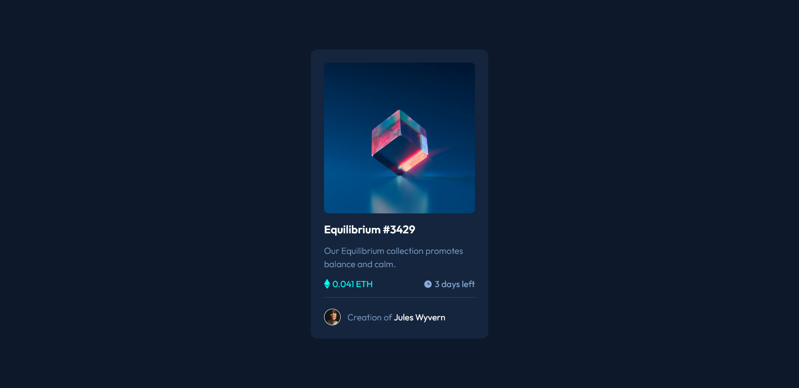
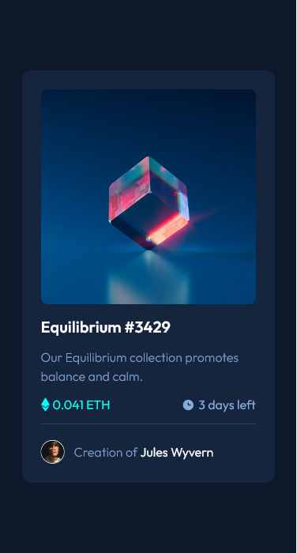

# Frontend Mentor - Product preview card component solution

This is a solution to
the [NFT preview card component challenge on Frontend Mentor](https://www.frontendmentor.io/challenges/nft-preview-card-component-SbdUL_w0U).
Frontend Mentor challenges help you improve your coding skills by building realistic projects.

## Table of contents

- [Overview](#overview)
    - [The challenge](#the-challenge)
    - [Screenshots](#screenshots)
- [My process](#my-process)
    - [Built with](#built-with)
    - [What I learned](#what-i-learned)
    - [Useful resources](#useful-resources)
- [Author](#author)

## Overview

### The challenge

Users should be able to:

- View the optimal layout for the interface depending on their device's screen size
- See hover and focus states for all interactive elements on the page

### Screenshots

## My process

### Built with

- Semantic HTML5 markup
- Tailwind CSS
- Mobile-first workflow

### What I learned

Using Tailwind CSS

### Useful resources

- [Tailwind documentation](https://tailwindcss.com/docs) - You don't need much more than knowing CSS and reading the
  tailwind documentation to learn everything about tailwind.

## Author

- GitHub - [YounesMakhlouf](https://github.com/YounesMakhlouf)
- Frontend Mentor - [@younesmakhlouf](https://www.frontendmentor.io/profile/YounesMakhlouf)